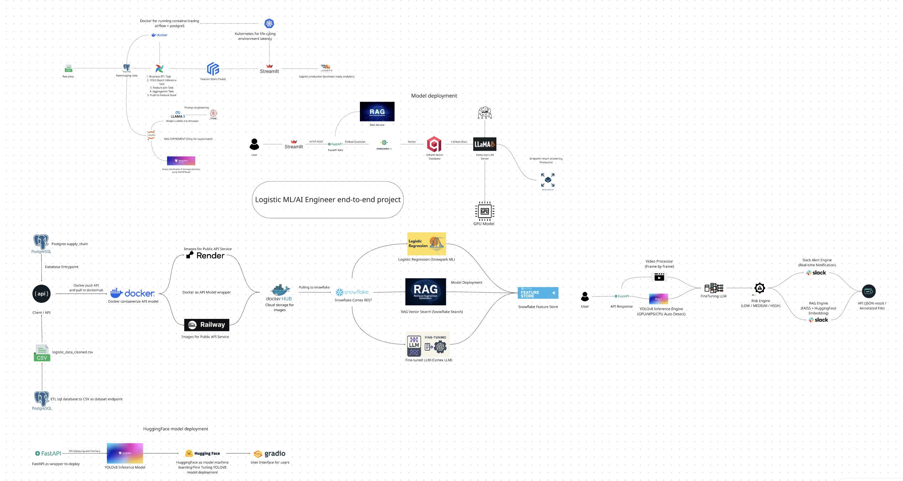
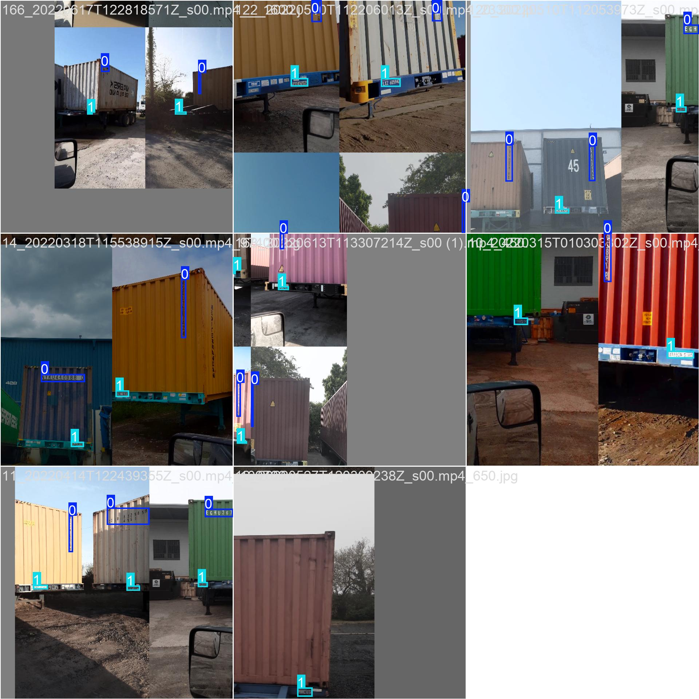
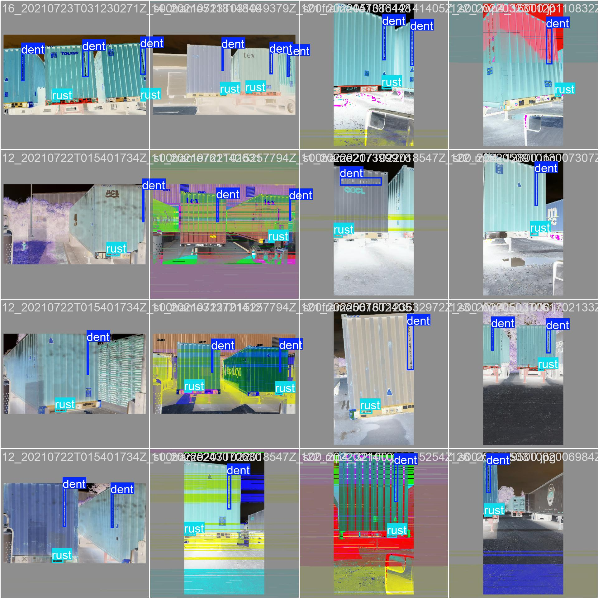
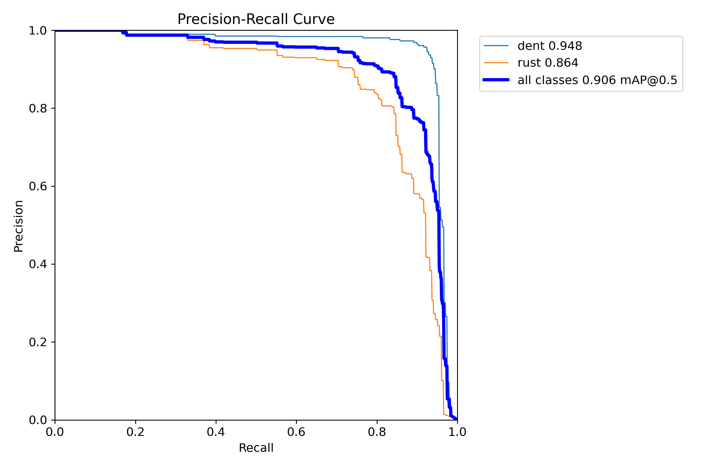
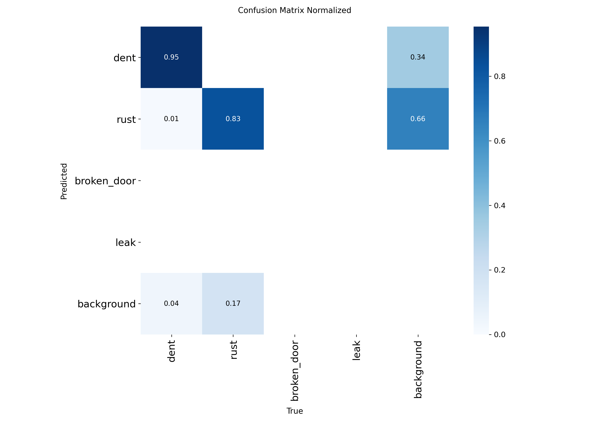

## 🎯 GOAL Project — Intelligent Container Inspection System
Inspection automation container using Vision + AI reasoning

## ♺ Workflow project:

## 🔹 Goals project:

### **1️⃣ Image Classification & Damage Detection**

- Detect: dent, rust, broken door, leak
- Classify: normal vs damaged
- Output severity level

### 2️⃣ RAG SOP & Compliance Engine

- Find SOP handling for broken container
- Answering shipment regulation
- Generate action recommendation

### 3️⃣ Risk Management Engine

- Count operational risk score
- Financial loss estimation
- Decision: allow / hold / reject shipment

# 📝 Logs progress

- Create raw table for Joining on staging SQL table
- Create schema sql classification table
- Load container images dataset and display in notebook as iterable

- Create visualize dashboard for Logistic-RAG Equivalent to ensure the classify container which are damaged vs normal
- Merged container image with sixth SQL components dataset
    1. CUMULATIVE INSPECTION METRIC
    2. DAILY PERFORMANCE LINE
    3. MONTHLY HEATMAP (LIKE IMAGE)
    4. YEARLY BAR PERFORMANCE
    5. DISTRIBUTION HISTOGRAM
    6. UANTILE PLOT (MODEL STABILITY)
- CORE IDEA such as engineering vocabulary
    - YOLO + vision = event generator
    - Visualizer on Streamlit = trend analyzer
    - RAG Engine = policy reasoning layer
    - Risk Engine = decision scorer
- Merge dataframe raw + YOLO container manipulation different database raw = Inspection Feature Mart
- Create Inspection Feature Mart with create new SQL logistics.container_registry and export to CSV for next feature inspection
- Data Modeling between YOLO container and dataframe CSV in merged
- Data modeling as result as Inspection Feature Mart is done.
- Continue in workflow Feast feature store for handling in Training dataset (ml engineering concept) to get result with ML Model (Risk/Defect prediction) → Online Inference
- Next in AI Engineering concept with llama3 model to improve dataset by prompting to ensure products relevant to dataset
- Training for RAG embedding experiment using YOLOv8 model in Notebook
- **TensorFlow SavedModel:** export success ✅ 224.6s have trained images using YOLOv8
    
    Training inference results
    
    - Detecting conttainer ID
    
    
    
    - Predicting confidence dent container
    
    
    
    - Validating confidence dent container
    
    
    
    - Validation container detection
    
    
    
    
    
    - Metrics confidence curve container detection
    
    
    
    
    
    
    
    
    
    
    
    