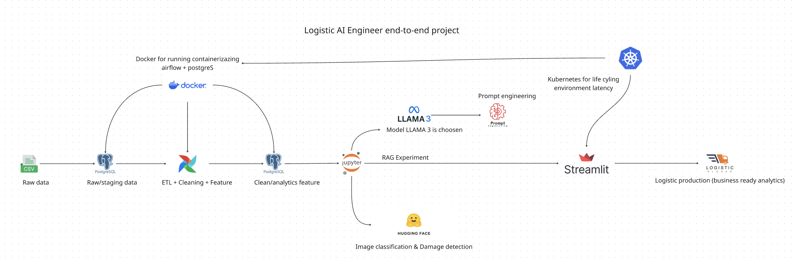

## 🎯 GOAL Project — Intelligent Container Inspection System
Inspection automation container using Vision + AI reasoning

## ♺ Workflow project:

## 🔹 Goals project:

### **1️⃣ Image Classification & Damage Detection**

- Detect: dent, rust, broken door, leak
- Classify: normal vs damaged
- Output severity level

### 2️⃣ RAG SOP & Compliance Engine

- Find SOP handling for broken container
- Answering shipment regulation
- Generate action recommendation

### 3️⃣ Risk Management Engine

- Count operational risk score
- Financial loss estimation
- Decision: allow / hold / reject shipment

# 📝 Logs progress

- Create raw table for Joining on staging SQL table
- Create schema sql classification table
- Load container images dataset and display in notebook as iterable
    

    
-