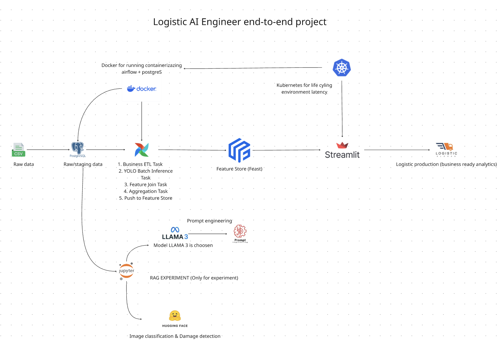
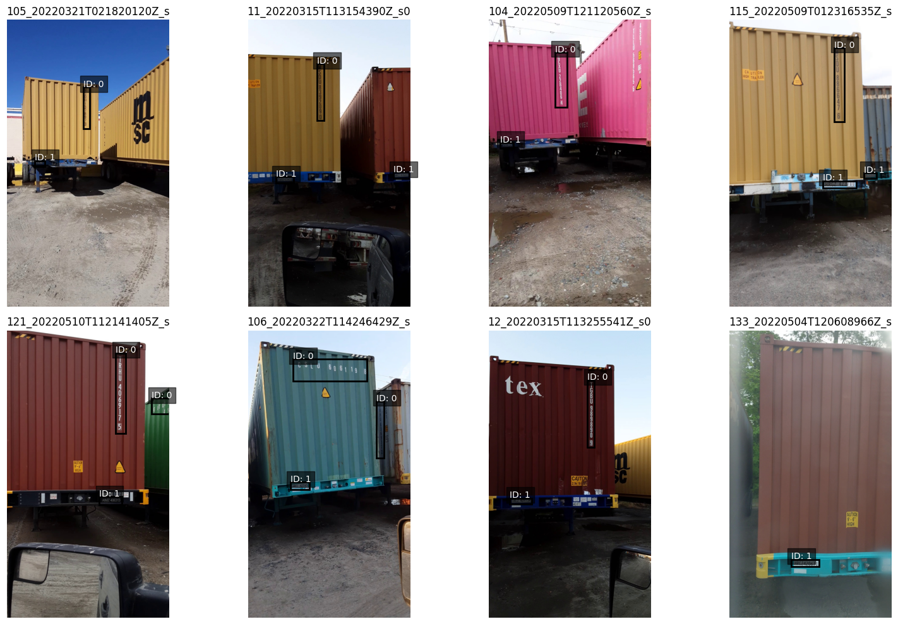

## 🎯 GOAL Project — Intelligent Container Inspection System
Inspection automation container using Vision + AI reasoning

## ♺ Workflow project:

## 🔹 Goals project:

### **1️⃣ Image Classification & Damage Detection**

- Detect: dent, rust, broken door, leak
- Classify: normal vs damaged
- Output severity level

### 2️⃣ RAG SOP & Compliance Engine

- Find SOP handling for broken container
- Answering shipment regulation
- Generate action recommendation

### 3️⃣ Risk Management Engine

- Count operational risk score
- Financial loss estimation
- Decision: allow / hold / reject shipment

# 📝 Logs progress

- Create raw table for Joining on staging SQL table
- Create schema sql classification table
- Load container images dataset and display in notebook as iterable
- Create visualize dashboard for Logistic-RAG Equivalent to ensure the classify container which are damaged vs normal
- Merged container image with sixth SQL components dataset
    1. CUMULATIVE INSPECTION METRIC
    2. DAILY PERFORMANCE LINE
    3. MONTHLY HEATMAP (LIKE IMAGE)
    4. YEARLY BAR PERFORMANCE
    5. DISTRIBUTION HISTOGRAM
    6. UANTILE PLOT (MODEL STABILITY)
- CORE IDEA such as engineering vocabulary
    - YOLO + vision = event generator
    - Visualizer on Streamlit = trend analyzer
    - RAG Engine = policy reasoning layer
    - Risk Engine = decision scorer
- dataframe are mixed with raw data + container manipulation = Inspection Feature Mart
    

    
-