## 🎯 GOAL Project — Intelligent Container Inspection System
Inspection automation container using Vision + AI reasoning

## ♺ Workflow project:
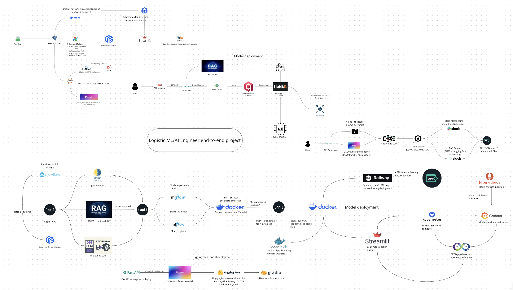

## 🔹 Goals project:

### **1️⃣ Image Classification & Damage Detection**

- Detect: dent, rust, broken door, leak
- Classify: normal vs damaged
- Output severity level

### 2️⃣ RAG SOP & Compliance Engine

- Find SOP handling for broken container
- Answering shipment regulation
- Generate action recommendation

### 3️⃣ Risk Management Engine

- Count operational risk score
- Financial loss estimation
- Decision: allow / hold / reject shipment

# 📝 Logs progress

- Create raw table for Joining on staging SQL table
- Create schema sql classification table
- Load container images dataset and display in notebook as iterable
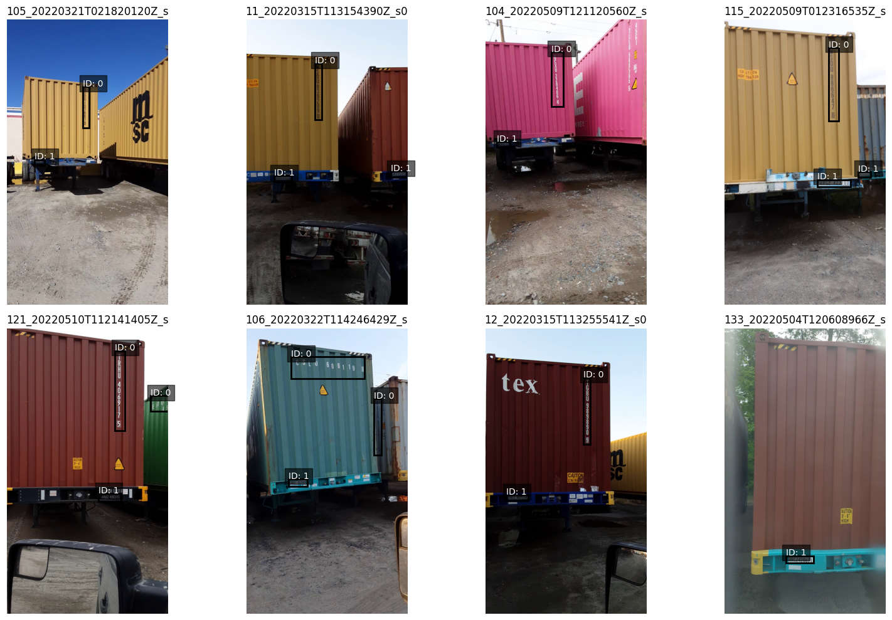
- Create visualize dashboard for Logistic-RAG Equivalent to ensure the classify container which are damaged vs normal
- Merged container image with sixth SQL components dataset
    1. CUMULATIVE INSPECTION METRIC
    2. DAILY PERFORMANCE LINE
    3. MONTHLY HEATMAP (LIKE IMAGE)
    4. YEARLY BAR PERFORMANCE
    5. DISTRIBUTION HISTOGRAM
    6. UANTILE PLOT (MODEL STABILITY)
- CORE IDEA such as engineering vocabulary
    - YOLO + vision = event generator
    - Visualizer on Streamlit = trend analyzer
    - RAG Engine = policy reasoning layer
    - Risk Engine = decision scorer
- Merge dataframe raw + YOLO container manipulation different database raw = Inspection Feature Mart
- Create Inspection Feature Mart with create new SQL logistics.container_registry and export to CSV for next feature inspection
- Data Modeling between YOLO container and dataframe CSV in merged
- Data modeling as result as Inspection Feature Mart is done.
- Continue in workflow Feast feature store for handling in Training dataset (ml engineering concept) to get result with ML Model (Risk/Defect prediction) → Online Inference
- Next in AI Engineering concept with llama3 model to improve dataset by prompting to ensure products relevant to dataset
- Training for RAG embedding experiment using YOLOv8 model in Notebook
- **TensorFlow SavedModel:** export success ✅ 224.6s have trained images using YOLOv8
    
    Training inference results
    
    - Detecting conttainer ID
    
    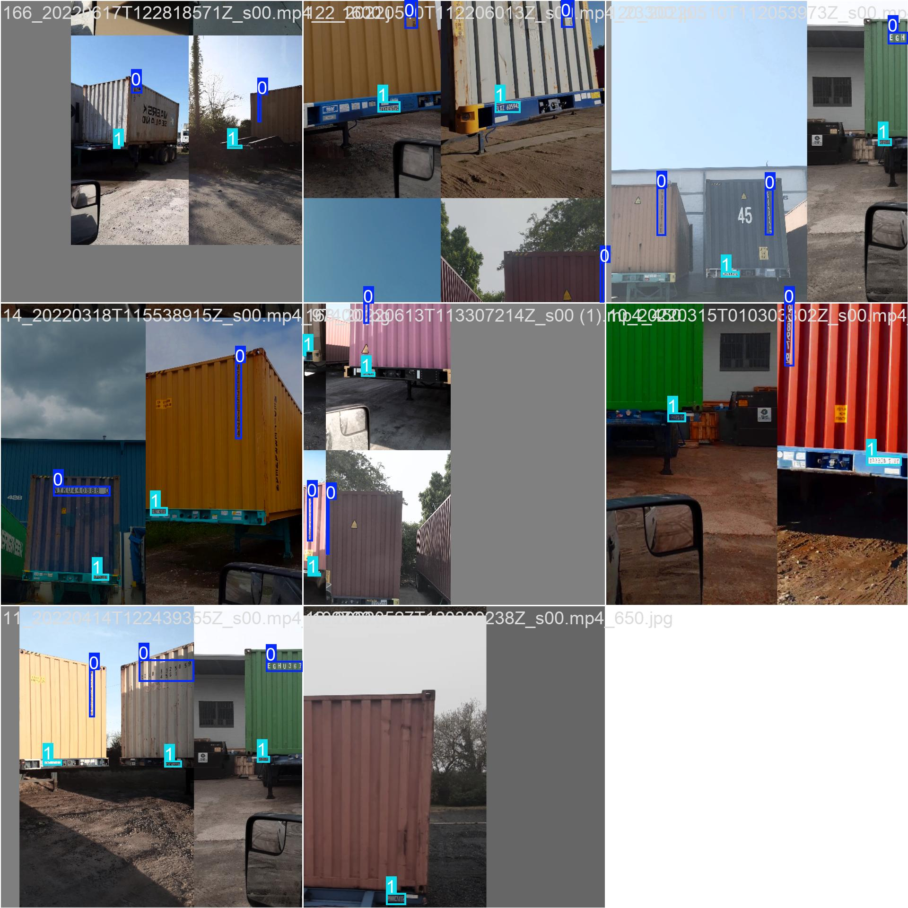
    
    - Predicting confidence dent container
    
    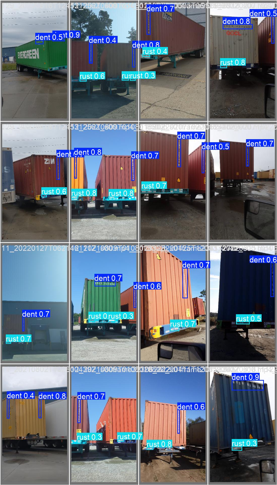
    
    - Validating confidence dent container
    
    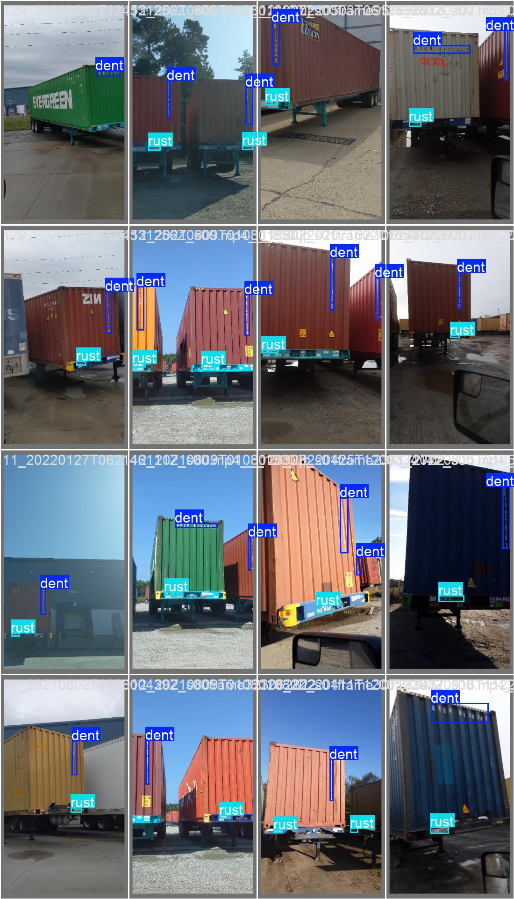
    
    - Validation container detection
    
    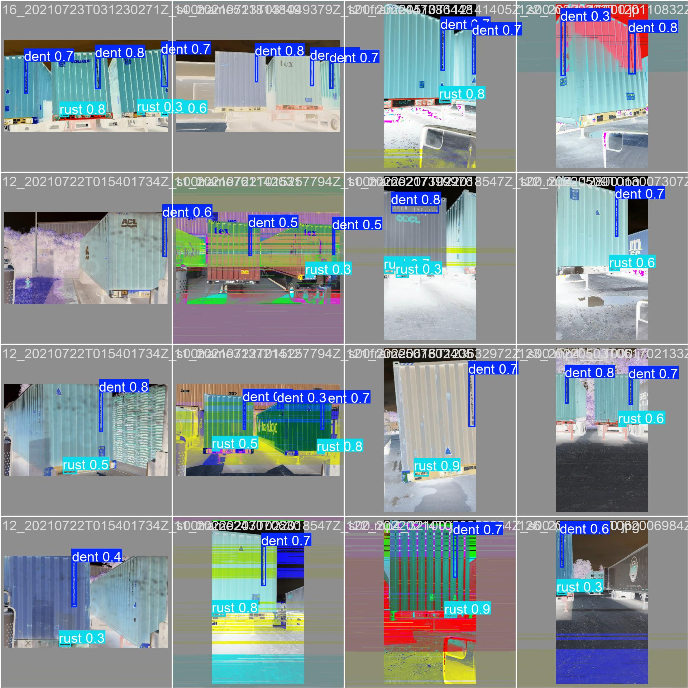
    
    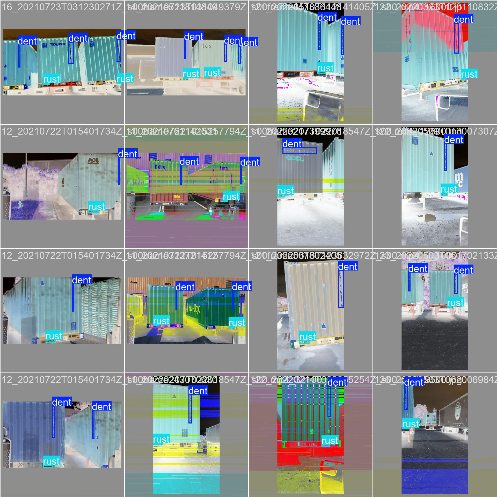
    
    - Metrics confidence curve container detection
    
    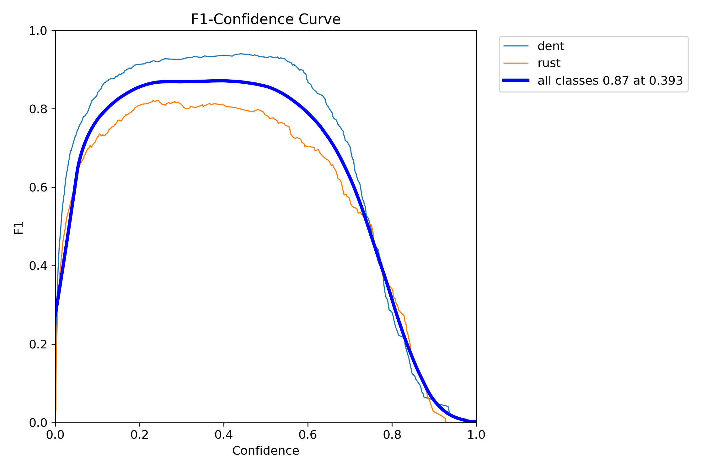
    
    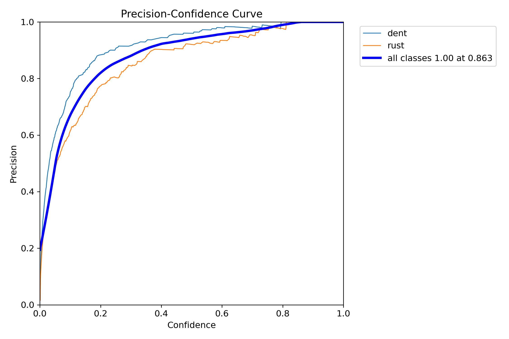
    
    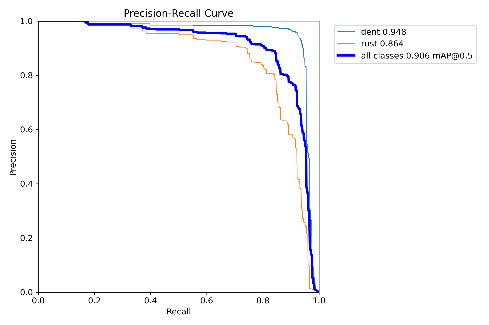
    
    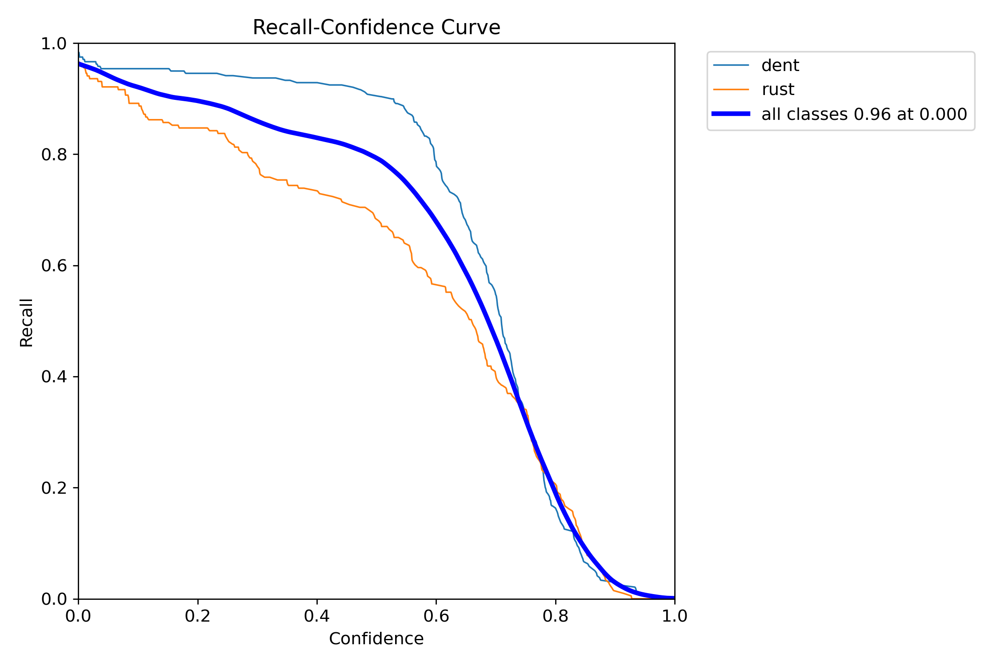
    
    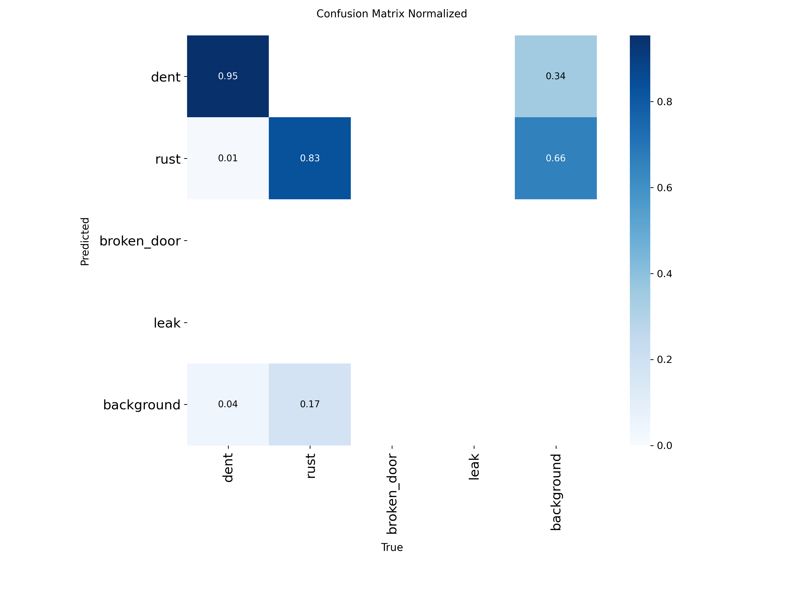
    
    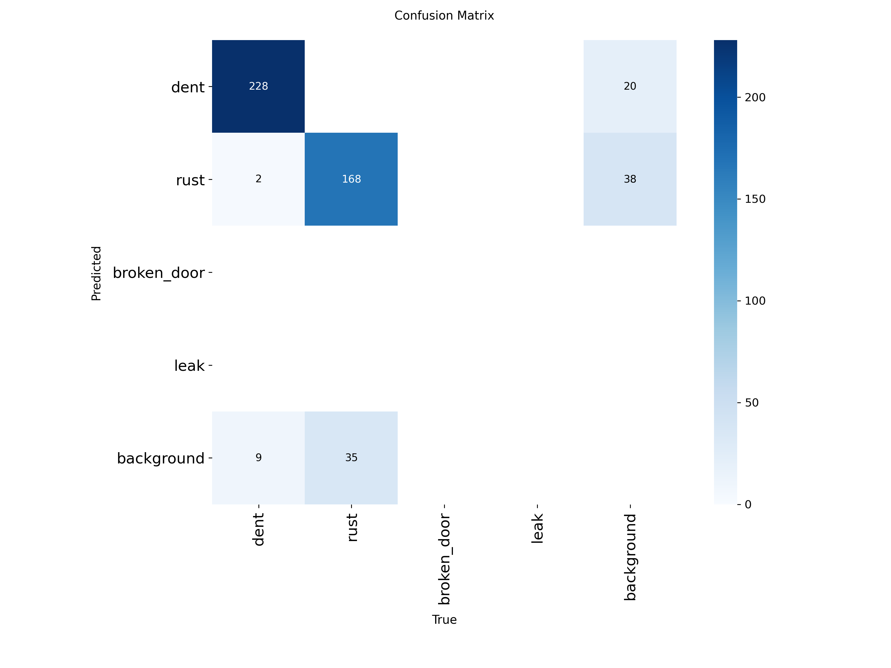

- Ingesting container video from youtube for training in RAG experiment using YOLOV8 model dataset are trained before
- Real-time container detection using YOLOV8 model. These are result of detection
    
    
    
- Create VectorDB for AI Engineer concept RAG Experiment layer
    
    
    
- LLama3 models is fething with SOP docs
    
    
    
- Result generating AI prompt engineering for business recommendations
- Use PDF document for integrating FAISS in comprehensive interpretability prompt
    
    
    
- Create THRESHOLD in notebook with model for calibration data train to ensure the threshold is relevant to SQL dataset
- Debugging in-relevant thresholds because dissyncronize with big gap data between df.describe() (statistics method) Note: Debug THRESHOLDS first before go for slack notifier
- Set slack environment for slack notification in production based on severity score inspection qualified. export SLACK_WEBHOOK_URL first to ensure echo $SLACK_WEBHOOK_URL is reliable to project
- Slack production for inspecting image result based http://localhost:8000/inspect-image on API endpoint in postman with variable:
    
    shipment_id: str,
    severity_score: float,
    alert_level: str,
    class_name: str
    
    Results:
    
    
    
    
    
- Postman as API endpoint test [localhost/inspect-image](http://localhost/inspect-image) result on postman
    
    
    
- Deploying machine learning model on logistic-rag project + deploying finetuning LLM & RAG AI Engineering on ❄️Snowflake deployment
- Create DATABASE, WAREHOUSE, SCHEMA, STAGE in snowflake environment. Snowflake databases are different with PostgreSQL database
    
    
    
- Wrapped API in docker images and container as containerization for API model wrapper deployment
    
    
    
- Build machine learning models and resulting feature importance for dataset prediction


- Deployed YOLOV8 model on container inspection logistic-rag for images and videos detection
    
    Container images inspection:
    
    
    
    
    
    Container videos inspection:
    
- Training model container dataset for damage container inspection using computer vision using YOLOV8 model
    
    
    
- Training model container dataset for container classification detection
    
    
    
- Epochs training using 100 epoch with patience=15 and stopped in 39/100 epocs training no models improvement
    
    
    
- Epochs training using 100 epoch with patience=10 and stopped in 35/100 epocs training because no models improvement
    
    
    
- Validation and visualization test with image and retrieve array result from images trained
    
    
    
- Validation test with image and retrieve array result from images trained
    
    
    
- Best metrics result from [best.pt](http://best.pt) YOLOV8 model was trained for improving model
    
    
    
    
    
- Video inspection container damage result with CLASS_MAP for identyfing DAMAGE and Container classification. ROI_DEBUG added for better performance to prevent false positive values
    
    
    
    
    
    
    
- Still caught up on container vision even the drone getting higher
    
    
    
- Videos
    
    
    
- Creating RAG Experimennt Layer and Create Vector DB embbeding use HuggingFace on (sentence-transformers/all-MiniLM-L6-v2) model name for read documents
- Finetuning LLM with OllamaLLM using llama3 model
    
    
    
- Prompting AI Engineering result using OllamaLLM
    
    
    
- Prompting full AI Generative results
    - 🤖 Generating AI business recommendation...
    
    ```
        ╔══════════════════════════════════════════════════════════════╗
        ║                 AI BUSINESS RECOMMENDATION                  ║
        ╠══════════════════════════════════════════════════════════════╣
        ║  **Risk Category:** Based on the inspection data and SOP    ║
        ║  context, I categorize the risk as **MEDIUM**. The severity ║
        ║  score of 4 indicates a moderate level of risk due to the   ║
        ║  presence of rust (2 containers) which could lead to        ║
        ║  structural damage or contamination of cargo.               ║
        ║                                                              ║
        ║  **Immediate Operational Action:** Recommend that all       ║
        ║  containers with rust damage be removed from service        ║
        ║  immediately and sent for repair to prevent any potential   ║
        ║  hazards.                                                   ║
        ║                                                              ║
        ║  **Repair Urgency:** The urgency of repair is **MEDIUM**.   ║
        ║  While it is essential to address the rust damage promptly, ║
        ║  it is not a critical issue requiring immediate attention.  ║
        ║  A timeline for repair should be established, taking into   ║
        ║  account the container's current usage and planned          ║
        ║  maintenance schedule.                                      ║
        ║                                                              ║
        ║  **Safety Mitigation:**                                     ║
        ║                                                              ║
        ║  1. Implement additional inspections on containers with     ║
        ║  rust damage to ensure the severity of the damage is        ║
        ║  accurately assessed.                                       ║
        ║  2. Conduct regular inspections of all containers to        ║
        ║  prevent similar issues from arising in the future.         ║
        ║  3. Develop a plan to address any underlying causes         ║
        ║  contributing to the rust damage, such as inadequate        ║
        ║  cleaning or poor storage conditions.                       ║
        ║                                                              ║
        ║  **Executive Summary:**                                     ║
        ║  The drone inspection result reveals 20 containers with no  ║
        ║  significant structural damage, but two containers          ║
        ║  exhibiting rust damage. This presents a moderate risk      ║
        ║  level, requiring prompt attention to prevent potential     ║
        ║  hazards. I recommend removing these containers from        ║
        ║  service and sending them for repair. A medium-level        ║
        ║  urgency is assigned for repair, considering the            ║
        ║  container's current usage and planned maintenance          ║
        ║  schedule. To mitigate this risk, additional inspections    ║
        ║  should be conducted, and a plan developed to address any   ║
        ║  underlying causes contributing to the rust damage.         ║
        ║                                                              ║
        ║  **Detailed Explanation:**                                  ║
        ║  The drone inspection result provides valuable insights     ║
        ║  into the condition of the containers. The absence of       ║
        ║  dents, broken doors, or leaks indicates that the           ║
        ║  containers are generally in good condition. However, the   ║
        ║  presence of rust damage in two containers poses a moderate ║
        ║  risk level. Rust can compromise the structural integrity   ║
        ║  of the container and contaminate cargo, making it          ║
        ║  essential to address this issue promptly.                  ║
        ║                                                              ║
        ║  The severity score of 4, based on the inspection data,     ║
        ║  supports the categorization of the risk as MEDIUM. This    ║
        ║  rating takes into account the potential consequences of    ║
        ║  inaction, including damage to the container or             ║
        ║  contamination of cargo, which could result in significant  ║
        ║  economic losses or even compromise food safety.            ║
        ║                                                              ║
        ║  To mitigate this risk, I recommend removing the containers ║
        ║  with rust damage from service and sending them for repair. ║
        ║  A medium-level urgency is assigned for repair, considering ║
        ║  the container's current usage and planned maintenance      ║
        ║  schedule. This allows for a reasonable timeframe to        ║
        ║  complete the repairs while still ensuring prompt attention ║
        ║  is given to prevent potential hazards.                     ║
        ║                                                              ║
        ║  In addition to addressing the rust damage, it is essential ║
        ║  to implement additional inspections on containers with     ║
        ║  similar issues to ensure the severity of the damage is     ║
        ║  accurately assessed. Regular inspections of all containers ║
        ║  should also be conducted to prevent similar issues from    ║
        ║  arising in the future. A plan should be developed to       ║
        ║  address any underlying causes contributing to the rust     ║
        ║  damage, such as inadequate cleaning or poor storage        ║
        ║  conditions.                                                ║
        ║                                                              ║
        ║  By taking these steps, we can minimize the risk associated ║
        ║  with rusty containers and ensure the safe transportation   ║
        ║  of goods while maintaining compliance with relevant        ║
        ║  regulations and standards.                                 ║
        ╚══════════════════════════════════════════════════════════════╝
    
    ```
    
    # ================================================================================
    RAW OUTPUT (for logging):
    
    **Risk Category:** Based on the inspection data and SOP context, I categorize the risk as **MEDIUM**. The severity score of 4 indicates a moderate level of risk due to the presence of rust (2 containers) which could lead to structural damage or contamination of cargo.
    
    **Immediate Operational Action:** Recommend that all containers with rust damage be removed from service immediately and sent for repair to prevent any potential hazards.
    
    **Repair Urgency:** The urgency of repair is **MEDIUM**. While it is essential to address the rust damage promptly, it is not a critical issue requiring immediate attention. A timeline for repair should be established, taking into account the container's current usage and planned maintenance schedule.
    
    **Safety Mitigation:**
    
    1. Implement additional inspections on containers with rust damage to ensure the severity of the damage is accurately assessed.
    2. Conduct regular inspections of all containers to prevent similar issues from arising in the future.
    3. Develop a plan to address any underlying causes contributing to the rust damage, such as inadequate cleaning or poor storage conditions.
    
    **Executive Summary:**
    The drone inspection result reveals 20 containers with no significant structural damage, but two containers exhibiting rust damage. This presents a moderate risk level, requiring prompt attention to prevent potential hazards. I recommend removing these containers from service and sending them for repair. A medium-level urgency is assigned for repair, considering the container's current usage and planned maintenance schedule. To mitigate this risk, additional inspections should be conducted, and a plan developed to address any underlying causes contributing to the rust damage.
    
    **Detailed Explanation:**
    The drone inspection result provides valuable insights into the condition of the containers. The absence of dents, broken doors, or leaks indicates that the containers are generally in good condition. However, the presence of rust damage in two containers poses a moderate risk level. Rust can compromise the structural integrity of the container and contaminate cargo, making it essential to address this issue promptly.
    
    The severity score of 4, based on the inspection data, supports the categorization of the risk as MEDIUM. This rating takes into account the potential consequences of inaction, including damage to the container or contamination of cargo, which could result in significant economic losses or even compromise food safety.
    
    To mitigate this risk, I recommend removing the containers with rust damage from service and sending them for repair. A medium-level urgency is assigned for repair, considering the container's current usage and planned maintenance schedule. This allows for a reasonable timeframe to complete the repairs while still ensuring prompt attention is given to prevent potential hazards.
    
    In addition to addressing the rust damage, it is essential to implement additional inspections on containers with similar issues to ensure the severity of the damage is accurately assessed. Regular inspections of all containers should also be conducted to prevent similar issues from arising in the future. A plan should be developed to address any underlying causes contributing to the rust damage, such as inadequate cleaning or poor storage conditions.
    
    # By taking these steps, we can minimize the risk associated with rusty containers and ensure the safe transportation of goods while maintaining compliance with relevant regulations and standards.
    

# Next step on MLOps system inference 🤖

- Docker contenarize components because Model is fetched **at container startup**.
    - Python runtime
    - FastAPI app
    - MLflow client
    - Inference logic
- Docker contenarize mlflow + minio + minio-init are bing wrapped in Dockerfile
    
    
    
- Remove minio-init because of MinIO will work without pre-created buckets
    
    
    
- MLflow Tracking & Registry models
    
    
    
    
    
- MLflow metrics result
    
    
    
- Machine learning models in minio storage
    
    
    
- YOLOV8 model in minio storage
    
    
    
- RAG model in minio storage
    
    
    
- Push to Dockerhub
    
    
    
- Build docker-compose.yml for inference system with adding Grafana, Prometheus, Streamlit, API, Minio, MLFlow.
    
    
    
- Slack receiving notifications which are triggered by API calls
- (result)
- Deploy result model to streamlit (UI 💻) as interface for user
- (result)
- Prometheus model metrics and Grafana visualization to display model metrics inference
- (result)
- Kubernetes for latency deployment inference serving
- (result)
- CI/CD Pipelines automation inference integrating
- (result)
- Deploy model to railway cloud (Railway deployment 💼)
- (result)
- 
- Build dockerfile images with purpose to push on dockerhub. After has been pushed, pull multimodel-api from dockerhub for retrieving coherent in deployment
    
    
    
- MLOps FastAPI [localhost](http://localhost) components
    
    
    
- Deployment services API in railway
    
    
    
    - API deployment in railway hosting cloud
        
        
        
    - Inference public API Service by railway deployment
    
    
    
- Integrated SQL database into  Feature Store and Spark hadoop as Data Features for ingesting in API.
    - Firstly, build EDA (Explore Data Analysis) in notebook for comprehensive machine learning models
    - Data will retrieve good pipelines from notebook’s ready for ingested to Spark hadoop
    - Ingested data on Spark hadoop for making reliable data to send on feature store
- **Decision Intelligence Pipeline source of SQL Database on notebook**:
    - **📸 CV detections (low-level evidence)**
        - **Aggregated inspection features (business-level signals)**
        - **Logistic model (risk scoring)**
        - Supervise learning for classification where container are damaged
        - **RAG (explainability, reasoning, auditability) (Optional)**
- Build container-risk-inspection for comprehensive prediction. Json output expect
    
    ```json
    {	
    "Image": "121_20220503T061259983Z_s00.mp4___1450.jpg"
    
    "model": Logistic Regression
    "predict"" float(result_predict) = example (result for safety shipment depends on predicting is_high_risk is 0.87
    
    "detection_yolo": "this container shipment is 0.9 confidence damaged" or "this container shipment is 0.3 confidence isn't damaged"
    
    "RAG fine tuning LLM": 
    - based on result "this container shipment is 0.9 confidence damaged" is "this container can't carry on shipping because the container is damaged" (note: make a profesional hypothesis based on result)
    - based on result "this container shipment is 0.3 confidence isn't damaged" is "this container can carry on shipping safely (note: make a profesional hypothesis based on result)
    }
    ```
    
- Uploading image for API testing
    
    
    
- Results of image prediction uploaded
    
    
    
    
    
- Deploy and inference to production (PENDING ⌛️)